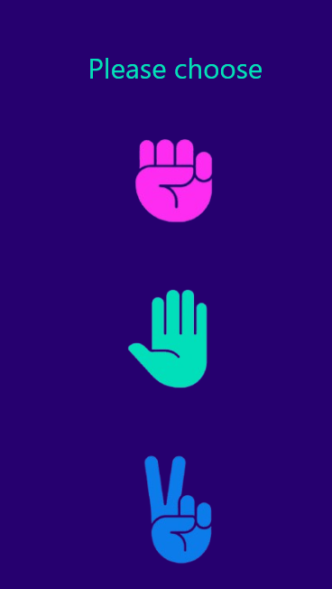
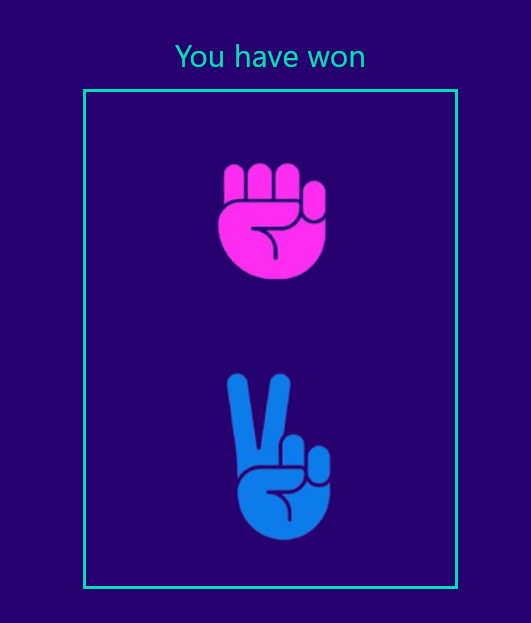
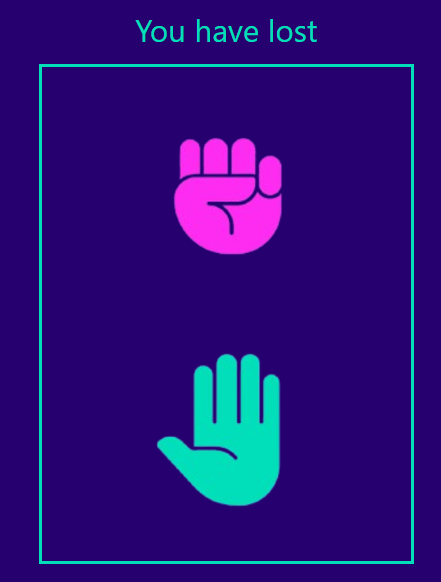
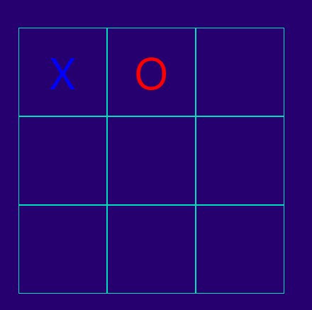
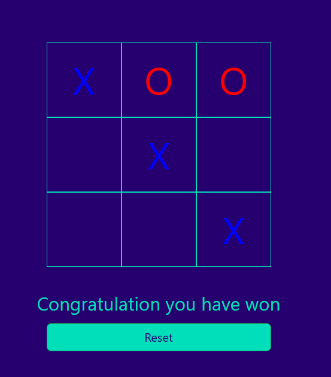
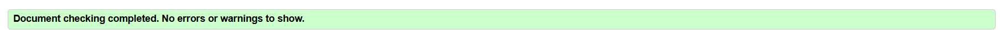
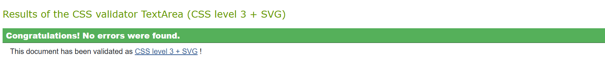

# Games
---
It's a website that let the user play Tic tac toe and rock paper scissor 

## Feature
### How to play rock paper scissor
---
* There are three provided images [ Rock - Paper - Scissor ] these are the choices for the user 
 

 

* User can choose one of them and in the computer choose a random choice 
* Win poissibles
    * paper win rock
    * scissor win paper
    * rock win scissor
* if user won the turn,a win message will be displayed above the result box and the win counter will be increased by one

* if user lost the turn ,a lost message will be displayed above the result box the lost counter will be increased by one

* if there is a draw ,a draw message will be displayed above the result box

### How to play tic tac toe
---
* This game is for 2 users 
* It consists of 9 tiles ( 3 x 3)
* There are two options ( X or O )
* The first user press one a tile and the other user press on another one

* User wins the match if user put 3 X or O in one row, column or diagonal

* if a user has won, a congrationlation message will be shown

### How to clone project
---
* git clone https://github.com/mohanadpro/games.git

## Testing
---
### Validator Testing Tic tac toe
* HTML
    * No errors were returned when passing through the official [W3C validator](https://validator.w3.org/#validate_by_input)

* CSS
    * No errors were found when passing through the official [(Jigsaw) validator](https://jigsaw.w3.org/css-validator/#validate_by_input)

* JavaScript
    * No errors were found when passing through the official [Jshint validator]()
        * The following metrics were returned:
        * There are 9 functions in this file.
        * Function with the largest signature take 2 arguments, while the median is 0.
        * Largest function has 13 statements in it, while the median is 5.
        * The most complex function has a cyclomatic complexity value of 11 while the median is 4.

### Validator Testing Rock paper scissor
---
* HTML
    * No errors were returned when passing through the official [W3C validator](https://validator.w3.org/#validate_by_input)

* CSS
    * No errors were found when passing through the official [(Jigsaw) validator](https://jigsaw.w3.org/css-validator/#validate_by_input)

* JavaScript
    * one error were found when passing through the official [Jshint validator](https://jshint.com/)
        * There are 4 functions in this file.
        * Function with the largest signature take 1 arguments, while the median is 0.
        * Largest function has 28 statements in it, while the median is 4.
        * The most complex function has a cyclomatic complexity value of 25 while the median is 1.

### Bugs
---
* No bugs were found

## Credits 
---
### Media
* Rock paper scissor images were taken from Vecteezy

### Deployment
---
* The site was deployed to GitHub pages. The steps to deploy are as follows:
    * In the GitHub repository, navigate to the Settings tab
    * From the source section drop-down menu, select the Master or main Branch
    * Once the master branch has been selected, the page will be automatically refreshed with a detailed ribbon display to indicate the successful deployment.
    * The live link can be found here - [live production](https://mohanadpro.github.io/games/)

## Used languages :
---
* JAVASCRIPT 
* HTML 
* CSS 
* BOOTSTRAP
