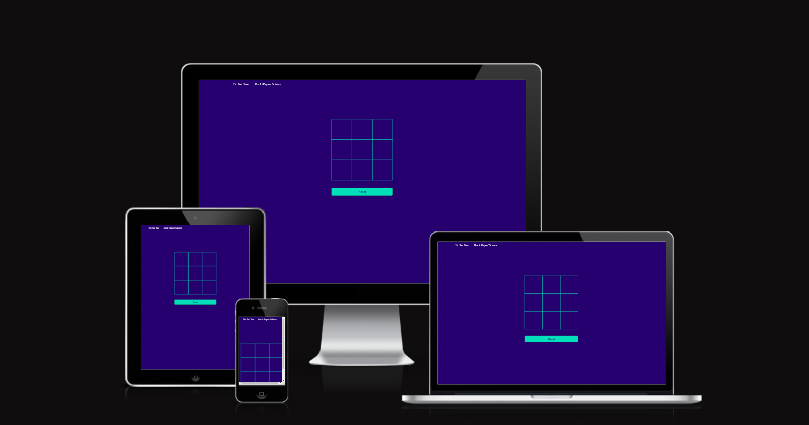

# Games
It's a website that let the user play Tic tac toe and rock paper scissor 

---

# How to play rock paper scissor 
* There are three provided images [ Rock - Paper - Scissor ] these are the choices for the user
* User choose one of them and in the computer choose a random choice 
* Win poissibles
    * paper win rock
    * scissor win paper
    * rock win scissor
* if user won the turn, the win counter will be increased by one
* if user lost the turn , the lost counter will be increased by one

---

# How to play tic tac toe
* This game consists of 9 tiles ( 3 x 3)
* There are two options ( X or O )
* User win if user put 3 X or O in one row, column or diagonal
* if user won a congrationlation message will be shown

---

# How to clone project
* git clone https://github.com/mohanadpro/games.git

---

# How to deploy project on Github
* Go to Github website
* Press on setting tab
* From the side bar press on pages
* In Build and deployment section choose, in source section choose Deploy from a branch
* In Branch  section choose main or master branch then save
* After 2 or 3 minutes go Code tab , on the right side bar press on Deployment section
* Then you will find the deployed link in All deployments section
* [live production](https://mohanadpro.github.io/games/)

---

# Used languages :
* JAVASCRIPT 
* HTML 
* CSS 
* BOOTSTRAP

---

# Helped websites
* Vecteezy : For images 
* Github : to upload the source code and deploy the website on

---

# The website programmed and designed by Mohanad Dahi 