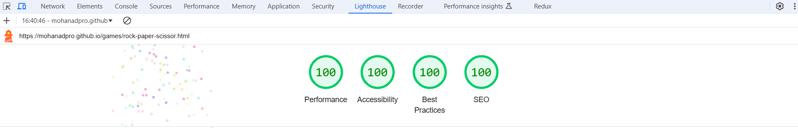

# Games
---
Welcome to Fun & Games Hub!

Dive into a world of classic entertainment with our engaging collection of timeless games: Tic Tac Toe and Rock Paper Scissors! Perfect for players of all ages, our website offers a fun and interactive experience that you can enjoy solo or with friends.

Why Choose Us?
* Easy to Play: Simple rules that anyone can understand.
* Responsive Design: Enjoy seamless gameplay on any device, whether you're on a computer, tablet, or smartphone.
* Multiplayer Options: Challenge friends or family and see who comes out on top!
* Fun Graphics: Colorful and engaging visuals to enhance your gaming experience.

## Design
### Used color
* #26006f - #01dfba

## Features
* Navigation bar

### How to play rock paper scissor
---
* There are three provided images [ Rock - Paper - Scissor ] these are the choices for the user 
 

 

* User can choose one of them and in the computer choose a random choice 
* Win poissibles
    * paper win rock
    * scissor win paper
    * rock win scissor
* if user won the turn,a win message will be displayed above the result box and the win counter will be increased by one

 

 

 

* if user lost the turn ,a lost message will be displayed above the result box the lost counter will be increased by one

 

 

 

* if there is a draw ,a draw message will be displayed above the result box

 

 

### How to play tic tac toe
---
* This game is for 2 users 
* It consists of 9 tiles ( 3 x 3)
* There are two options ( X or O )
* The first user press one a tile and the other user press on another one

 

 

* User wins the match if user put 3 X or O in one row, column or diagonal

 

 

* if a user has won, a congrationlation message will be shown

 

 

## Used languages :
---
* JAVASCRIPT 
* HTML 
* CSS 
* BOOTSTRAP

## Testing
---
### Validator Testing Tic tac toe
* HTML
    * No errors were returned when passing through the official [W3C validator](https://validator.w3.org/#validate_by_input)

 

 

* CSS
    * No errors were found when passing through the official [(Jigsaw) validator](https://jigsaw.w3.org/css-validator/#validate_by_input)

 

 

* JavaScript
    * No errors were found when passing through the official [Jshint validator]()
        * The following metrics were returned:
        * There are 9 functions in this file.
        * Function with the largest signature take 2 arguments, while the median is 0.
        * Largest function has 13 statements in it, while the median is 5.
        * The most complex function has a cyclomatic complexity value of 11 while the median is 4.

### Validator Testing Rock paper scissor
---
* HTML
    * No errors were returned when passing through the official [W3C validator](https://validator.w3.org/#validate_by_input)

 

 

* CSS
    * No errors were found when passing through the official [(Jigsaw) validator](https://jigsaw.w3.org/css-validator/#validate_by_input)

 

 

* JavaScript
    * No error were found when passing through the official [Jshint validator](https://jshint.com/)
        * There are 4 functions in this file.
        * Function with the largest signature take 1 arguments, while the median is 0.
        * Largest function has 28 statements in it, while the median is 4.
        * The most complex function has a cyclomatic complexity value of 25 while the median is 1.

### Analyze page load
* It provides the best practice, when it is tested through lighthouse

 

 

### Manual Testing
* In tic tac toe game pressing on tiles twice the first time i got 'X' and the second time i got 'O'
* I clicked on rock paper scissor navigation bar and the page is work succesfully

## Bugs
---
### Fixed bugs
* In tic tac toe game the player was able to press on tile after one player won

## Deployment
---
* The site was deployed to GitHub pages. The steps to deploy are as follows:
    * In the GitHub repository, navigate to the Settings tab
    * From the source section drop-down menu, select the Master or main Branch
    * Once the master branch has been selected, the page will be automatically refreshed with a detailed ribbon display to indicate the successful deployment.
    * The live link can be found here - [live production](https://mohanadpro.github.io/games/)

* To clone the project
    1. On GitHub, navigate to the main page of the repository.
    2. Above the list of files, click <> Code.
    3. Copy the URL for the repository.
        * To clone the repository using HTTPS, under "HTTPS", click .
        * To clone the repository using an SSH key, including a certificate issued by your organization's SSH certificate authority, click SSH, then click .
        * To clone a repository using GitHub CLI, click GitHub CLI, then click
    4. Open Git Bash
    5. Change the current working directory to the location where you want the cloned directory.
    6. Type git clone, and then paste the URL you copied earlier.
        git clone https://github.com/mohanadpro/games.git
    7. Press enter
* To fork project
    1. On GitHub, navigate to the octocat/Spoon-Knife repository.
    2. Click Fork in the top right corner of the page .
    3. Under Owner, select the dropdown menu and then select an owner for the forked repository.
    4. By default, forks are given the same name as their upstream repositories. To further distinguish your fork, you can optionally enter a name in the "Repository name" field.
    5. Optionally, enter a description for your fork in the “Description” field.
    6. Optionally select Copy default branch only .
    7. Click Create Fork .

## Credits 
---
### Media
* Rock paper scissor images were taken from Vecteezy
### Code
*  to validate written code
*  to get information in coding
* ![Am i responsive][https://ui.dev/amiresponsive] to see project in different screens
